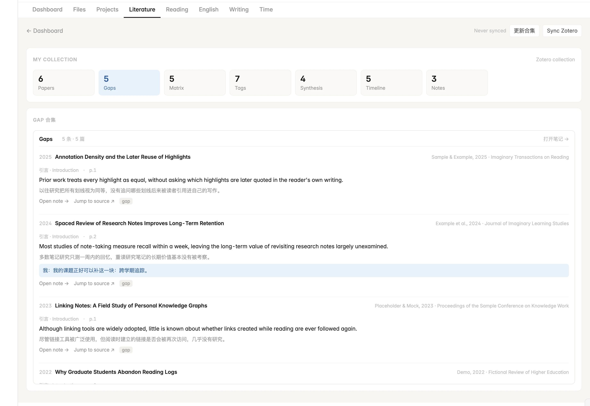
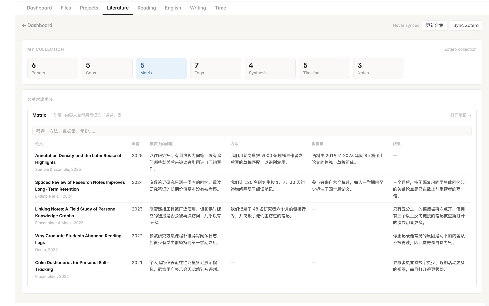

# OneDesk

**English** · [中文](README.zh-CN.md)

An all-in-one dashboard for Obsidian, built around a graduate student's day: tasks and stray thoughts, projects, literature, time, writing and English practice in one view. Everything is read from, and written back to, plain Markdown notes in your vault.

> The interface is currently in Chinese. English UI is planned.


## What's inside

- **Dashboard** — today's tasks, one box to capture a question or a someday idea the moment it interrupts you, quick links to your daily note, life log and reviews, a punch clock and countdowns. [Read more →](docs/en/dashboard.md)
- **Literature** — turns a Zotero collection into a research gap collection, a comparison matrix, a tag index and a related-work draft grouped by topic. [Read more →](docs/en/literature.md)
- **Projects** — next actions and a progress timeline for each project, and one timeline across all of them. [Read more →](docs/en/projects.md)
- **Time** — a one-tap punch clock, your schedule against what actually happened, and rhythm metrics like golden hours used. [Read more →](docs/en/time.md)
- **Writing** — daily practice with terms and sentence moves drawn from the papers you read, and a pipeline for public writing. [Read more →](docs/en/writing.md)
- **English** — sentence patterns practised as chunks on a four-week plan, and a daily speaking drill built from what you did yesterday. [Read more →](docs/en/english.md)
- **Reading** — stats and your latest thoughts from book notes. [Read more →](docs/en/reading.md)
- **Files** — browse, preview and edit the vault in three panes. [Read more →](docs/en/files.md)

<table>
  <tr>
    <td width="50%"><a href="docs/en/literature.md"></a><br><sub>Research gap collection</sub></td>
    <td width="50%"><a href="docs/en/literature.md"></a><br><sub>Comparison matrix</sub></td>
  </tr>
  <tr>
    <td width="50%"><a href="docs/en/projects.md"></a><br><sub>Project timelines</sub></td>
    <td width="50%"><a href="docs/en/time.md"></a><br><sub>Time and rhythm</sub></td>
  </tr>
</table>

## Install

OneDesk needs the [Dataview](https://github.com/blacksmithgu/obsidian-dataview) plugin (JavaScript queries do not need to be enabled).

**With BRAT** (updates automatically): install **BRAT** from Community plugins, run *BRAT: Add a beta plugin for testing*, enter `https://github.com/L-WangLi/obsidian-onedesk`, then enable **OneDesk**.

**Manually**: download `main.js`, `manifest.json` and `styles.css` from the [latest release](https://github.com/L-WangLi/obsidian-onedesk/releases/latest) into `<vault>/.obsidian/plugins/onedesk/`, then enable **OneDesk**.

## Try it in a minute

1. Open a new, empty vault and install Dataview and OneDesk.
2. Run **OneDesk: 创建示例笔记** (create sample notes) from the command palette.
3. Every tab fills with a fictional week of tasks, projects, punches, papers and books.

## Documentation

| | |
| --- | --- |
| [Getting started](docs/en/getting-started.md) | Install, sample notes, folder conventions, settings, syncing across devices |
| [Dashboard](docs/en/dashboard.md) | Why capture helps you focus; Today, Capture, questions, quick open, daily note, life log, reviews |
| [Literature](docs/en/literature.md) | The graduate-student workflow: gaps, matrix, tags, related-work draft, Zotero sync |
| [Projects](docs/en/projects.md) · [Files](docs/en/files.md) | Project notes and timelines; the vault browser |
| [Time](docs/en/time.md) · [Writing](docs/en/writing.md) · [English](docs/en/english.md) · [Reading](docs/en/reading.md) | Punch clock and schedule; writing practice; patterns and speaking drill; book notes |

## Your notes stay yours

OneDesk has no database. Every card is a view over ordinary Markdown notes, so what it writes can be read, edited, searched and synced like anything else in your vault. It works on desktop and mobile, with a single-column layout on phones; only the Zotero sync itself needs the desktop app.

## Development

No dependencies — the build is a single Node script.

```bash
npm run build                                               # writes main.js
npm run dev -- "/path/to/vault/.obsidian/plugins/onedesk"   # rebuild into a vault on every change
npm run example                                             # writes example-vault/ with the plugin installed
npm test
```

Sources are in `src/`. To release, bump the version in `manifest.json` and `versions.json` and push a tag with the same version; GitHub Actions builds, tests and publishes the release.

## License

[MIT](LICENSE)
