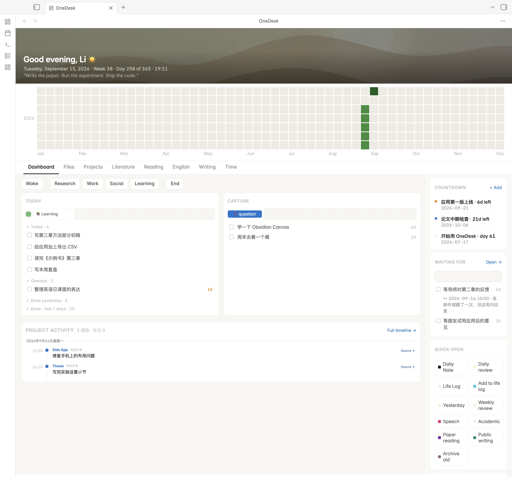
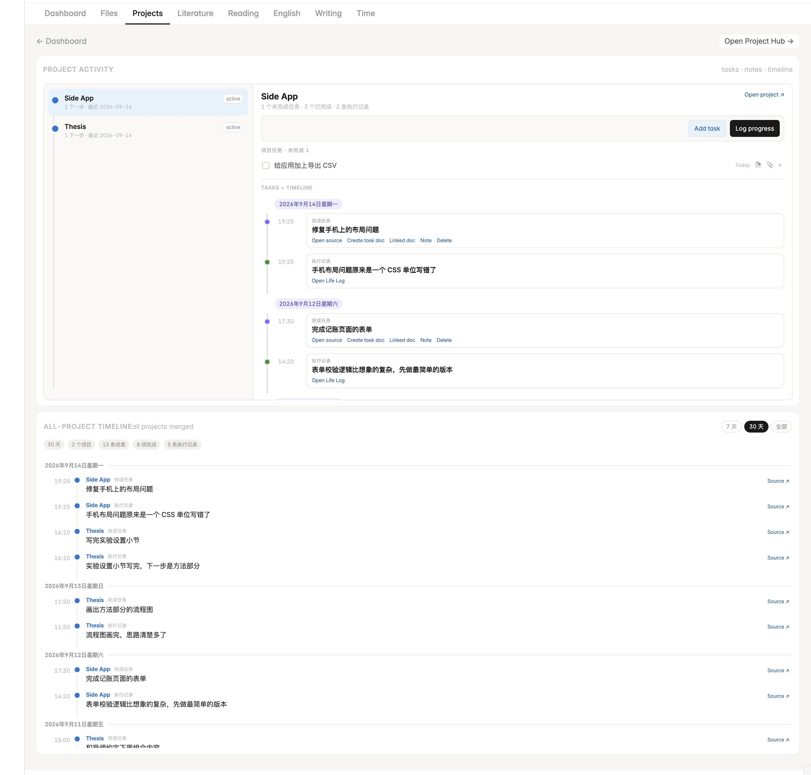
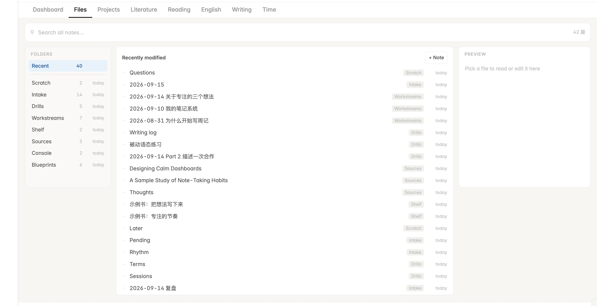
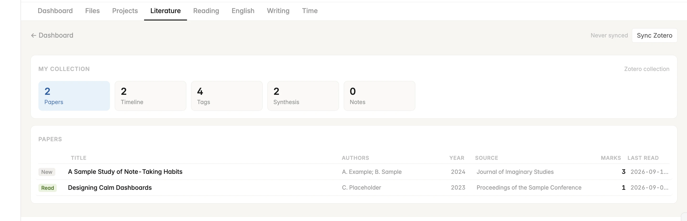
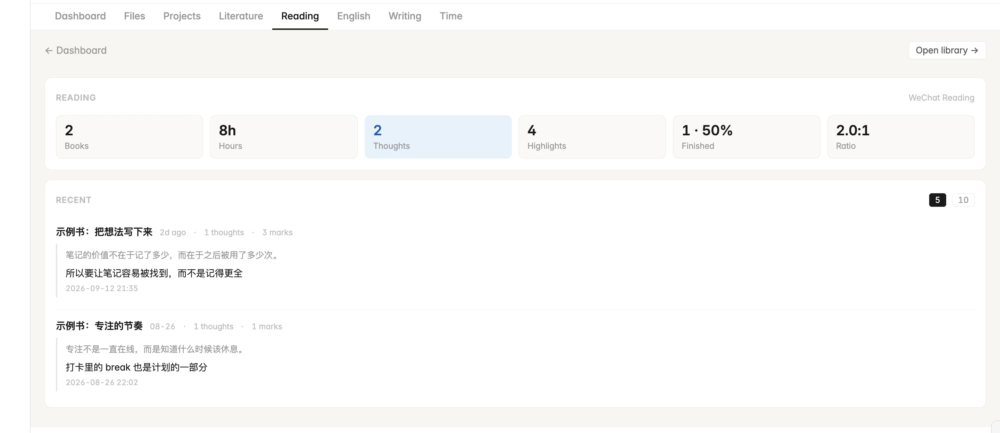
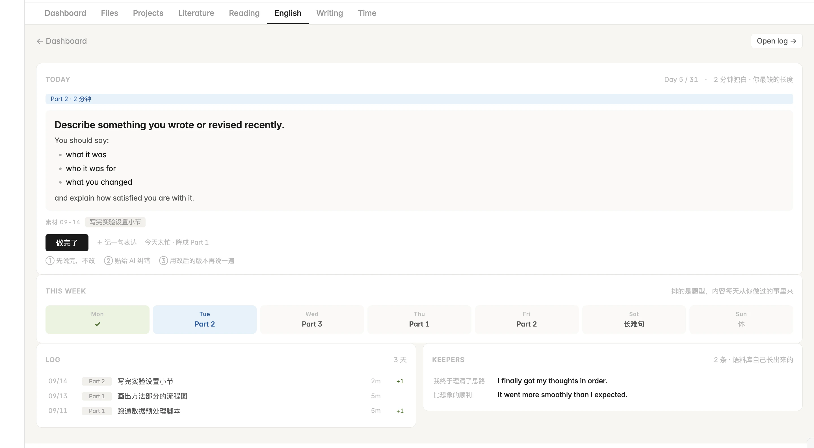
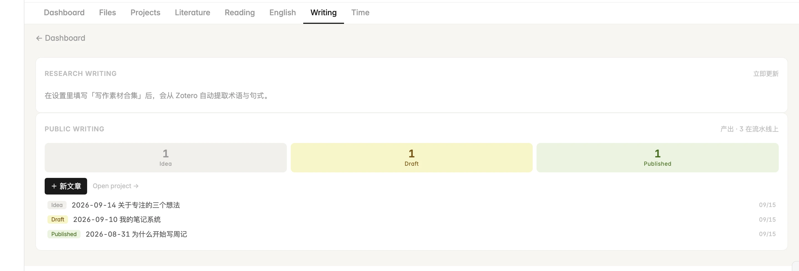
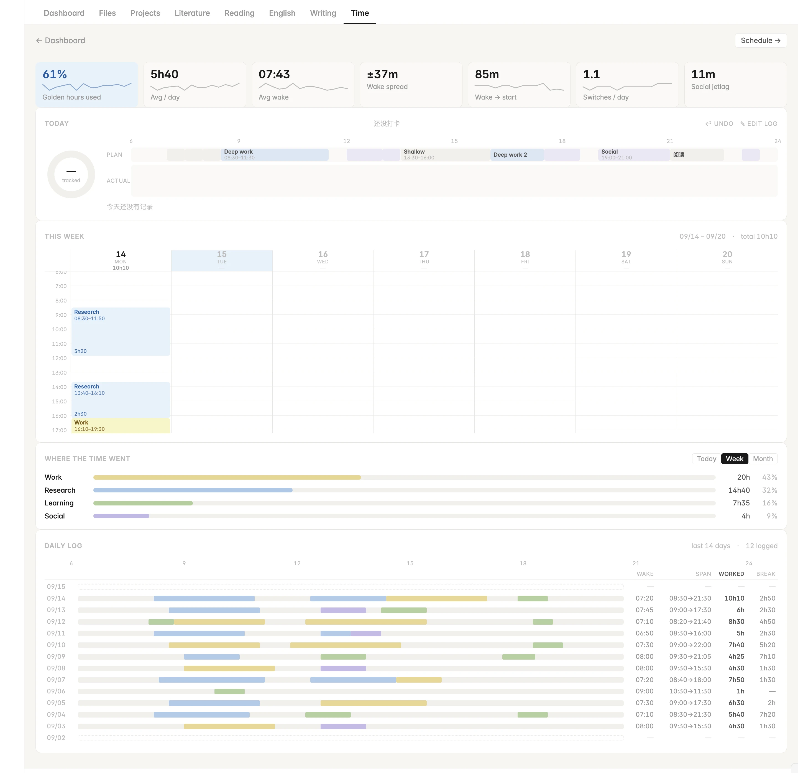

# OneDesk

[English](README.md) · **中文**

一站式的 Obsidian 工作台。在一个视图里集中今天的任务、项目进展、打卡计时、读书与文献笔记、写作练习和英语口语日课——所有内容都读写自 vault 里的普通 Markdown 笔记。



## 功能

| 页面 | 作用 |
| --- | --- |
| **Dashboard** | 今日任务、添加任务到当天日记、项目看板、打卡、倒数日、等待清单与想做清单、快速入口、活跃度热力图 |
| **Files** | 三栏浏览 vault：文件夹、笔记列表、可直接编辑的预览 |
| **Projects** | 每个项目的下一步、已完成任务和生活日志合成一条时间线；另有全部项目的 7 天 / 30 天 / 全部时间线 |
| **Literature** | 把 Zotero 合集导入为每篇论文一篇笔记，划线自动归到论文自己的章节下（仅电脑端，见下文） |
| **Reading** | 读书笔记（`📌` 划线、`💭` 想法）的统计与最近想法 |
| **English** | 固定题型的口语日课（短问答 / 2 分钟独白 / 抽象展开），题目内容来自你当天做过的事，并积累表达 |
| **Writing** | 从文献中提取学术句式做练习；公开写作按 idea → draft → published 管理 |
| **Time** | 按活动打卡；今日环形图、本周日历、时间去向，以及与作息计划的对比 |

不用的页面可以在设置里关闭。

## 截图

所有截图使用插件自带的虚构示例笔记。

### Projects · 项目
每个项目的下一步、已完成任务和生活日志，以及所有项目合并的时间线。



### Files · 文件
浏览文件夹与最近修改的笔记，右侧预览可直接编辑。



### Literature · 文献
从 Zotero 合集导入的论文，含划线数、阅读记录与状态。详见 [文献功能详解](#文献功能详解)。



### Reading · 阅读
书籍数、阅读时长、划线与最近的想法。



### English · 英语
根据你前一天做过的事生成今天的口语题，附一周计划、练习记录和积累的表达。



### Writing · 写作
来自 Zotero 合集的学术写作练习，以及公开写作的进度。



### Time · 时间
作息指标、今日计划与实际对比、本周日历、时间去向，以及最近 14 天的记录。



## 需要

- Obsidian 1.4.10 或更高版本（电脑端或手机端）
- 安装并启用 [Dataview](https://github.com/blacksmithgu/obsidian-dataview) 插件。**不需要**开启「允许 JavaScript 查询」。

## 安装

### 用 BRAT 安装（推荐，自动更新）

1. 在第三方插件市场安装并启用 **BRAT**。
2. 运行命令 **BRAT: Add a beta plugin for testing**。
3. 填入 `https://github.com/L-WangLi/obsidian-onedesk`。
4. 在「设置 → 第三方插件」中启用 **OneDesk**。

### 手动安装

1. 从 [最新 Release](https://github.com/L-WangLi/obsidian-onedesk/releases/latest) 下载 `main.js`、`manifest.json`、`styles.css`。
2. 放到 `<你的 vault>/.obsidian/plugins/onedesk/`。
3. 重新加载 Obsidian，在「设置 → 第三方插件」中启用 **OneDesk**。

## 快速开始

1. 新建一个空 vault，装好 Dataview 和 OneDesk。
2. 在命令面板运行 **OneDesk: 创建示例笔记**。
3. OneDesk 会显示一周虚构的项目、任务、打卡、读书和文献记录，每个页面都有内容。

示例里的 `OneDesk 示例说明.md` 说明了哪篇笔记对应哪张卡片。看懂之后删掉示例，换成你自己的笔记即可。

## 笔记约定

OneDesk 没有数据库，每张卡片都是普通笔记的视图。约定如下（文件夹名是默认值，可以修改）：

| 内容 | 位置 | 格式 |
| --- | --- | --- |
| 项目 | `Workstreams/<项目>/Overview.md` | frontmatter：`type: project`、`project_id`、`note_label`、`area`、`status` |
| 任务 | 日记 `Intake/Days/` | `- [ ] 内容 #Academic [when:: 2026-01-15] [project:: thesis]` |
| 生活日志 | `Intake/Log/2026-01-15 life log.md` | `- 09:30 · 内容`；带上项目概览的链接，就会进入该项目时间线 |
| 打卡 | `Console/Clock.md` | `## 2026-01-15` 下写 `- 08:30 in research`、`- 11:50 break` |
| 倒数日 | `Console/Dates.md` | `- 2026-02-01 · 名称` |
| 等待 / 想做 | `Intake/Pending.md`、`Scratch/Later.md` | `- [ ] 2026-01-15 · 内容` |
| 作息计划 | `Intake/Days/Rhythm.md` | 表格：`\| 08:30 - 11:30 \| 深度工作 \| … \|` |
| 读书笔记 | `Shelf/` | `> 📌 划线`、`- 💭 想法`、`- ⏱ 2026-01-15 21:30` |
| 文献 | `Sources/Reading/Zotero/` | frontmatter `type: paper`（由 Zotero 同步生成） |
| 模板 | `Blueprints/` | `Daily Note Template`、`Life Log Template` 等 |

如果启用了核心「日记」插件，日记的位置和日期格式以它的设置为准。

## 文献功能详解

划线留在 Zotero，思考放在 Obsidian。文献页把一个 Zotero 合集变成可以速览、按标签检索、并能逐步写成综述草稿的阅读笔记。

### 准备（电脑端）

1. 使用 Zotero 6 或 7，数据目录保持默认的 `~/Zotero`。
2. 确认装有 `sqlite3` 命令行工具：macOS 自带；Linux 用包管理器安装；暂不支持 Windows。
3. 把正在读的论文放进一个合集，在「设置 → OneDesk → Zotero 合集」里填写它的**完整名称**（不包含子合集）。
4. 在文献页点 **Sync Zotero**。

OneDesk 读取的是 Zotero 数据库的临时副本，Zotero 可以保持打开；不会往 Zotero 里写任何东西。

### 同步会生成什么

**每篇论文一篇笔记**，放在 `Sources/Reading/Zotero/`，以标题命名。frontmatter 包括 `title`、`authors`、`year`、`venue`、`doi`、`zotero_key`、`status`（`unread` 未读、`read` 已读、划线达到 20 条为 `deep` 精读）、`highlights` 与 `figures` 数量、`last_read`，以及 `sessions`（每个做过批注的日子一行）。正文从上到下：

| 部分 | 内容 |
| --- | --- |
| 标题行 | 作者 · 年份 · 期刊/会议，附「在 Zotero 中打开」和 DOI 链接 |
| **速览** | 四行表格：想解决的问题、方法、数据集、结果。自动取自打了 `gap`/`research gap`/`问题`、`method`/`方法`、`dataset`/`数据集`、`result`/`结果` 标签的划线。你手填的行会一直保留，直到有带标签的划线填上它。 |
| **图表** | 你在 PDF 里框选的图和表，复制到 `_figures/<zotero key>/`，并从 PDF 正文中取图注（如 `Fig. 2. …`）作说明；按图注关键词分为方法、实验设置、结果。 |
| **我划的句子** | 划线按论文自身的章节归组：摘要、引言、相关工作、方法、实验设置、结果、讨论、结论（根据 Zotero 的全文缓存识别）。每条显示标签、页码，以及可跳回 PDF 原位置的链接；便签按位置插在划线之间。 |
| 素材 | 折叠的提示框，列出 gap 与方法句子，以及你写过的所有内容，供写综述时参考 |
| **综述段落**、**我的话** | 属于你的部分。在这里为 related work 写一段话。 |

关于划线：

- 16 个字符以内、且不含逗号、句号、分号的标签视为分类标签；在标签框里输入的更长句子会被当作笔记，显示在句子下方的 **我：** 行。
- 批注的评论里你写的话同样显示为 **我：**。如果翻译插件把译文写在评论的 `🔤` 标记之间，这部分会以浅色译文显示。

**你写的内容永远不会被覆盖。**每次同步时，笔记中从 `## 综述段落` 到文末的内容原样保留。笔记通过 `zotero_key` 对应论文，所以在 Zotero 里改标题只会让笔记改名，不会丢失你写的内容。在 Zotero 删除图片批注，vault 里对应的图片也会删除。

**`Sources/Reading/Thoughts.md`** 汇总你**自己**在 Zotero 里写的内容：便签、批注评论里你的话、子笔记。按论文归组，最近写过的排在前面。不是你写的笔记（阅读时长插件数据、arXiv 备注、TL;DR、只是重复划线的自动生成笔记）会被排除。这个文件每次同步都会整篇重写，要修改请在 Zotero 里改。

如果图表处提示「Zotero 还没渲染这张图」，在 Zotero 里点开一次该批注后再同步即可。

### 五种视图

| 视图 | 内容 |
| --- | --- |
| **Papers** | 全部论文，含状态（New / Read / Deep）、作者、年份、来源、划线数、最近阅读日期 |
| **Timeline** | 每一天读了哪篇论文、划了多少条 |
| **Tags** | 整个合集的划线按标签归组，另有「Untagged」。每条显示论文、章节、页码、译文和你的笔记，可打开笔记或跳到 PDF 原位置。 |
| **Synthesis** | 你写过的所有「综述段落」，按论文年份从早到晚排列，就是一份 related work 草稿，可一键复制；下方列出已划线但还没写的论文 |
| **Notes** | 读取 `Thoughts.md` 的内容 |

### 其他页面也会用到

- **English**：长难句那天，题目来自你划过、并带有译文的英文句子。
- **Writing**：*Research writing* 从设置中「写作素材合集」指定的合集（含子合集）论文全文里提取术语与句式；填写这个设置之前不会读取 Zotero。

一个让所有视图都好用的标注习惯：阅读时，给指出问题的句子打 `gap`，方法打 `method`，数据打 `dataset`，主要结论打 `result`。

## 设置

- **称呼、启动时打开**
- **模块**：隐藏不用的页面
- **文件夹**：修改任意默认位置。改上级文件夹（如「收件箱」）时，由它推导出的位置会一起变。
- **项目看板（高级）**：默认显示所有未归档、未完成的项目。需要固定顺序、颜色或别名时填写 JSON，示例见英文 README。

### 多设备同步设置

很多同步工具不会同步插件自己的 `data.json`。在设置里点 **创建配置文件**，设置会保存为 vault 里的 `onedesk.json`，像普通笔记一样同步；在一台设备上修改，其他设备会自动读取。

## 仅电脑端可用的部分

- 文献页的 **Zotero 同步** 通过 `sqlite3` 命令行工具读取 Zotero 数据库，会在 `/usr/bin`、`/opt/homebrew/bin`、`/usr/local/bin` 中查找（macOS、Linux）。同步生成的笔记和文献页的所有视图在任何设备上都能使用。
- 写作页的 **Research writing** 从设置中「写作素材合集」指定的 Zotero 合集提取术语与句式。填写之前不会读取 Zotero；素材建立后手机端也能使用。
- 其他功能在手机端都可以使用。

## 开发

没有任何依赖，构建只是一个 Node 脚本：

```bash
npm run build                                               # 生成 main.js
npm run dev -- "/path/to/vault/.obsidian/plugins/onedesk"   # 修改后自动构建到指定 vault
npm run example                                             # 生成装好插件的 example-vault/
npm test
```

发布：修改 `manifest.json` 与 `versions.json` 中的版本号，推送同名 tag，GitHub Actions 会自动构建、测试，并把 `main.js`、`manifest.json`、`styles.css` 附到 Release。

## 许可证

[MIT](LICENSE)
