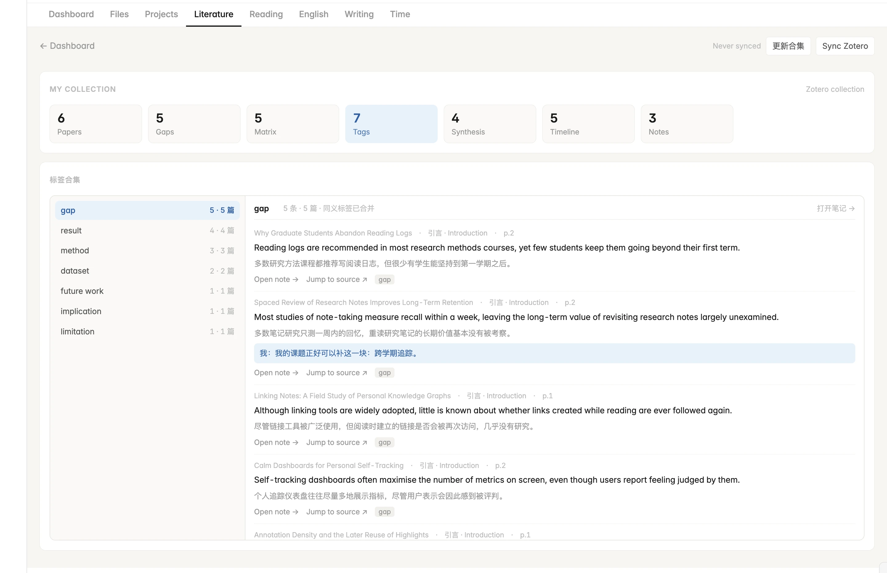
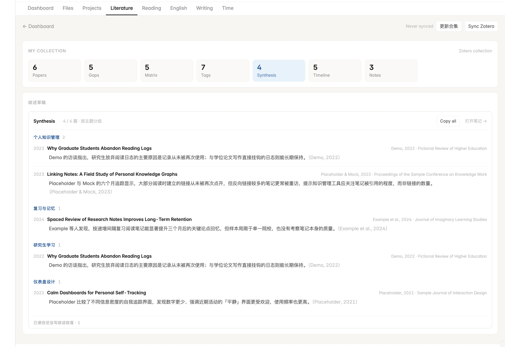
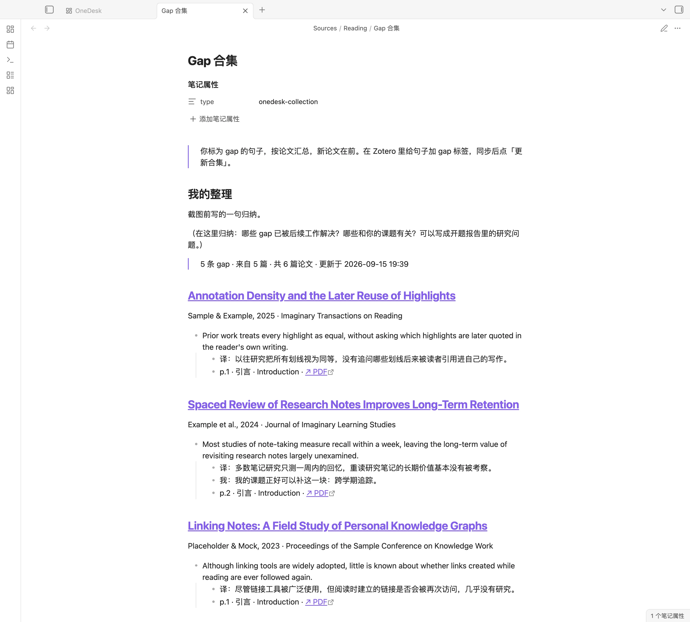

[← OneDesk](../../README.zh-CN.md) · [English](../en/literature.md) · **中文**

# 研究生文献管理

写学位论文要读几十篇文献，真正要回答的问题都是跨论文的：*别人指出过哪些研究缺口？各篇的方法和数据集怎么比？关于某个主题大家都说了什么？怎么把这些写成 related work？*

OneDesk 用你本来就会在 Zotero 里做的划线来回答这些问题：划线留在 Zotero，汇总和写作放在 Obsidian。

## 使用流程

1. **在 Zotero 里读和划线。**给指出问题的句子打 `gap` 标签，方法打 `method`，数据打 `dataset`，主要结论打 `result`；也可以加任何其他标签（`limitation`、`future work`、`baseline`……）。自己的想法写在批注评论里。
2. **同步。**在文献页点 **Sync Zotero**：每篇论文生成一篇笔记，下面四个合集也会一起重建。
3. **每篇写一段话。**在论文笔记的 `## 综述段落` 下，写你在 related work 里会怎么介绍它；在 frontmatter 里填主题，如 `topics: [图神经网络, 小样本学习]`。
4. **用合集。**Gap 合集用来提炼研究问题、写开题报告；矩阵用来比较方法；标签合集用来查看某个主题下的所有观点；综述草稿就是文献综述的初稿。

## 四个合集

**Gap 合集**：所有标为 gap 的句子，按论文汇总、新论文在前，附译文、你的批注、页码和跳回 PDF 的链接。已读但还没标 gap 的论文列在下方，避免遗漏。`gap`、`research gap`、`问题`、`研究缺口` 都算同一个标签。


**文献对比矩阵**：每篇论文一行，并排比较想解决的问题、方法、数据集和结果，内容来自每篇笔记的「速览」表。可以按任意关键词筛选，比如数据集名称或年份；你在笔记表格里手填的内容也会显示在这里。


**标签合集**：整个合集的划线按标签归组，显示每个标签有多少条划线、涉及几篇论文；同义标签自动合并。



**综述草稿**：你写过的所有「综述段落」，按 `topics` 分组，组内按论文年份从早到晚排列，每段末尾附（作者, 年份）引用。**Copy all** 会把带主题标题的整份草稿复制到剪贴板；已读但还没写的论文列在下方。



## 合集会生成普通笔记

每次同步，或点文献页的 **更新合集**，四个合集都会写成 `Sources/Reading/` 下的普通笔记：`Gap 合集`、`文献矩阵`、`标签合集`、`综述草稿`。可以搜索、在开题报告里链接、在手机上查看，也会像普通笔记一样同步。

每篇顶部都有 **我的整理** 区域，用来写你自己的归纳。`%% OneDesk … %%` 这一行以上的内容属于你，永远不会被改写；每次只重新生成这一行以下的部分。



合集只在同步或点按钮时重建，打开页面不会自动改写文件，所以多台设备同步同一个 vault 时不会互相冲突。

## 标签同义词

在「设置 → OneDesk → 标签同义词」里，把多种写法合并成一个标签，每行一组：

```text
gap: limitation of prior work, 局限
baseline: baselines, 对比方法
```

这些会追加到内置的 `gap`、`method`、`dataset`、`result` 同义词里。

## 设置 Zotero 同步（电脑端）

1. 使用 Zotero 6 或 7，数据目录保持默认的 `~/Zotero`。
2. 确认装有 `sqlite3` 命令行工具：macOS 自带；Linux 用包管理器安装；暂不支持 Windows。
3. 把论文放进一个合集，在「设置 → OneDesk → Zotero 合集」里填写它的**完整名称**（不含子合集）。
4. 点 **Sync Zotero**。

OneDesk 读取的是 Zotero 数据库的临时副本，Zotero 可以保持打开；不会往 Zotero 写任何东西。所有视图和合集在手机上都能基于已同步的笔记使用。

## 论文笔记包含什么

每篇论文一篇笔记，放在 `Sources/Reading/Zotero/`，以标题命名。frontmatter 包括 `title`、`authors`、`year`、`venue`、`doi`、`zotero_key`、`status`（`unread`、`read`，划线达到 20 条为 `deep`）、`highlights` 与 `figures` 数量、`last_read`、`sessions`（每个做过批注的日子一行）和 `topics`。

| 部分 | 内容 |
| --- | --- |
| 标题行 | 作者 · 年份 · 来源，附「在 Zotero 中打开」和 DOI 链接 |
| **速览** | 想解决的问题、方法、数据集、结果，取自带对应标签的划线；手填的行会保留，直到有带标签的划线填上它 |
| **图表** | 你在 PDF 里框选的图表，复制到 `_figures/<zotero key>/`，从 PDF 正文取图注，按方法、实验设置、结果分组 |
| **我划的句子** | 按论文自身章节（摘要、引言、方法、结果……）归组，每条有标签、页码和跳回 PDF 的链接；便签按位置插在其间 |
| 素材 | 折叠的列表：gap 与方法句子，以及你写过的所有内容 |
| **综述段落**、**我的话** | 属于你 |

- 16 个字符以内、且不含逗号、句号、分号的标签视为分类标签；在标签框里输入的更长句子会被当作笔记，和批注评论里的话一起显示为 **我：**。评论里 `🔤` 标记之间的内容显示为浅色译文。
- **你写的内容永远不会被覆盖**：每次同步，从 `## 综述段落` 到文末原样保留。笔记通过 `zotero_key` 对应论文，Zotero 里改标题不会丢失内容。
- `Sources/Reading/Thoughts.md` 汇总你在 Zotero 里写的便签、批注评论和子笔记，排除不是你写的笔记（阅读时长数据、arXiv 备注、TL;DR、只重复划线的笔记）。
- 图表处提示「Zotero 还没渲染这张图」时，在 Zotero 里点开一次该批注再同步。

## 文献页的全部视图

| 视图 | 内容 |
| --- | --- |
| **Papers** | 状态（New / Read / Deep）、作者、年份、来源、划线数、最近阅读 |
| **Gaps** | Gap 合集 |
| **Matrix** | 文献对比矩阵，可筛选 |
| **Tags** | 标签合集 |
| **Synthesis** | 按主题分组的综述草稿，可一键复制 |
| **Timeline** | 每天读了哪篇、划了多少 |
| **Notes** | `Thoughts.md` 的内容 |

其他页面也用这些笔记：长难句那天，**English** 用你划过、带译文的英文句子出题；**Writing** 从「写作素材合集」指定合集的论文全文里提取学术句式。

---

文档: [快速开始](getting-started.md) · [首页：随手记录与每日节奏](dashboard.md) · [项目](projects.md) · [文件](files.md) · **研究生文献管理** · [阅读](reading.md) · [英语](english.md) · [写作](writing.md) · [时间](time.md)
